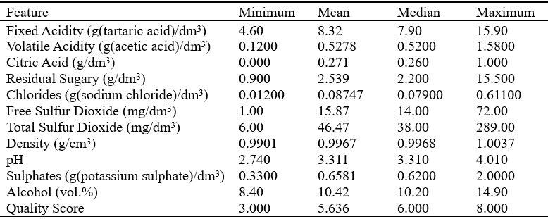
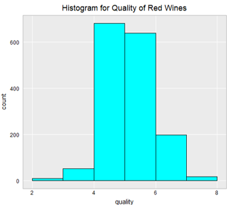
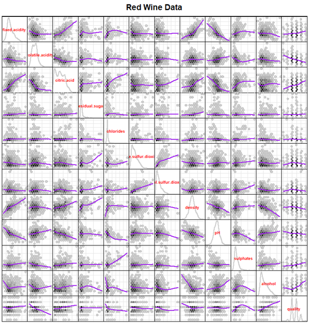

## Red Wine Analysis Project by Alyssa Soderlund

This is my final project for Stats 515 at George Mason University. 
Wine is a complex product with many facets that contribute to taste and quality. Understanding the major factors that attribute most to the quality of a wine is an important business analysis issue. My project attempts to understand what attributes impact the quality of a wine and how one can predict a wine’s quality by performing exploratory data analysis, variable subset selection, and creating multiple classification models. 

### The Dataset
The dataset comes from the UCI Machine Learning Repository ([Data](https://archive.ics.uci.edu/ml/datasets/Wine+Quality)). 

This dataset, from the University of California, Irvine machine learning repository, was collected between 2004-2007 (Cortez et al., 2009). It focuses specifically on the vinho verde red wine from Portugal. Each wine was assessed in a laboratory for 11 different physicochemical features. Then, a quality score from 1 to 10 was derived by measuring the median of a minimum of three blind sensory tests conducted by wine experts (Cortez et al., 2009). 

The attributes of this dataset are: 
- Alcohol percentage
- Volatile acidity 
- Citric acid
- Fixed acidity
- Residual sugar
- Density
- pH
- Free sulfur dioxide 
- Total sulfur dioxide
- Chlorides
- Sulphates
- Quality

### Exploratory Data Analysis
Table 1 shows a summary of all the variables. There are no quality scores below 3 or above 8, so there’s no really high or low quality wines. This may skew results because there’s no data on the makeup of a “perfect” wine. 



   _Table 1_

A histogram of the quality scores shows the distribution of the dependent variable in Figure 1. This shows that a large majority of the scores lie between 4 and 6, so most of the wines included in the dataset are of average quality.



   _Figure 1_

<details><summary>View Code</summary>
<p>

```R
   ggplot(data= redData, aes(quality)) + 
    geom_histogram(breaks= seq(2, 8, by=1), col="black", fill="cyan") + 
    labs(title= "Histogram for Quality of Red Wines") + hw
```

</p>
</details>

The scatterplot matrix in Figure 2 shows the distributions of all variables along the diagonal and a scatterplot for each pair of variables with a smooth showing the correlation between the pairs. A few variables have very skewed distributions, including residual sugar, chlorides, free sulfur dioxide, total sulfur dioxide, and sulphates. These variables will benefit from a log transformation to fix the skew later. 

Other important aspects of Figure 2 are the pairs of variables with strong correlations. Variables that are correlated with each other include all of the acid variables (fixed acidity, volatile acidity, and citric acid), fixed acidity and density, fixed acidity and pH, and chlorides and sulphates. Variables that are strongly correlated with quality based on the scatterplot matrix are volatile acidity (which makes the wine taste like vinegar when high), sulphates, and alcohol percentage. This is the first indication that these variables may be strong predictors of quality.



   _Figure 2_

**include box plots?**


```markdown
Syntax highlighted code block

# Header 1
## Header 2
### Header 3

- Bulleted
- List

1. Numbered
2. List

**Bold** and _Italic_ and `Code` text

[Link](url) and 
```

For more details see [Basic writing and formatting syntax](https://docs.github.com/en/github/writing-on-github/getting-started-with-writing-and-formatting-on-github/basic-writing-and-formatting-syntax).

### Jekyll Themes

Your Pages site will use the layout and styles from the Jekyll theme you have selected in your [repository settings](https://github.com/asoderlund/WineAnalysis/settings/pages). The name of this theme is saved in the Jekyll `_config.yml` configuration file.

### Support or Contact

Having trouble with Pages? Check out our [documentation](https://docs.github.com/categories/github-pages-basics/) or [contact support](https://support.github.com/contact) and we’ll help you sort it out.
