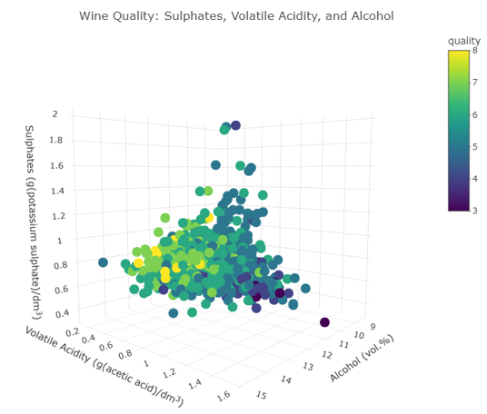
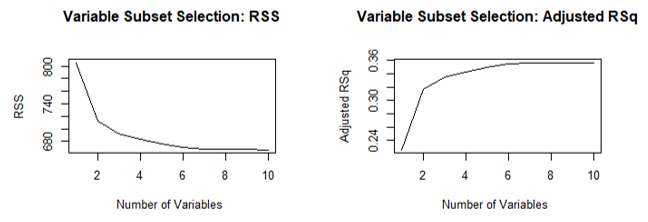

## Red Wine Analysis Project by Alyssa Soderlund

This is my final project for Stats 515 at George Mason University. 
Wine is a complex product with many facets that contribute to taste and quality. Understanding the major factors that attribute most to the quality of a wine is an important business analysis issue. My project attempts to understand what attributes impact the quality of a wine and how one can predict a wine’s quality by performing exploratory data analysis, variable subset selection, and creating multiple classification models. 

### The Dataset
The dataset comes from the UCI Machine Learning Repository ([Data](https://archive.ics.uci.edu/ml/datasets/Wine+Quality)). 

This dataset, from the University of California, Irvine machine learning repository, was collected between 2004-2007 (Cortez et al., 2009). It focuses specifically on the vinho verde red wine from Portugal. Each wine was assessed in a laboratory for 11 different physicochemical features. Then, a quality score from 1 to 10 was derived by measuring the median of a minimum of three blind sensory tests conducted by wine experts (Cortez et al., 2009). 

The attributes of this dataset are: 
- Alcohol percentage
- Volatile acidity 
- Citric acid
- Fixed acidity
- Residual sugar
- Density
- pH
- Free sulfur dioxide 
- Total sulfur dioxide
- Chlorides
- Sulphates
- Quality

### Exploratory Data Analysis
Table 1 shows a summary of all the variables. There are no quality scores below 3 or above 8, so there’s no really high or low quality wines. This may skew results because there’s no data on the makeup of a “perfect” wine. 


   _Table 1_

A histogram of the quality scores shows the distribution of the dependent variable in Figure 1. This shows that a large majority of the scores lie between 4 and 6, so most of the wines included in the dataset are of average quality.


   _Figure 1_


```
   ggplot(data= redData, aes(quality)) + 
    geom_histogram(breaks= seq(2, 8, by=1), col="black", fill="cyan") + 
    labs(title= "Histogram for Quality of Red Wines") + hw
```


The scatterplot matrix in Figure 2 shows the distributions of all variables along the diagonal and a scatterplot for each pair of variables with a smooth showing the correlation between the pairs. A few variables have very skewed distributions, including residual sugar, chlorides, free sulfur dioxide, total sulfur dioxide, and sulphates. These variables will benefit from a log transformation to fix the skew later. 

Other important aspects of Figure 2 are the pairs of variables with strong correlations. Variables that are correlated with each other include all of the acid variables (fixed acidity, volatile acidity, and citric acid), fixed acidity and density, fixed acidity and pH, and chlorides and sulphates. Variables that are strongly correlated with quality based on the scatterplot matrix are volatile acidity (which makes the wine taste like vinegar when high), sulphates, and alcohol percentage. This is the first indication that these variables may be strong predictors of quality.


   _Figure 2_

<details><summary>View Code</summary>
<p>

```splom(redData, as.matrix = TRUE,
      xlab = '',main = "Red Wine Data",
      pscale = 0, varname.col = "red",
      varname.cex = 0.56, varname.font = 2,
      axis.text.cex = 0.4, axis.text.col = "red",
      axis.text.font = 2, axis.line.tck = .5,
      panel = function(x,y,...) {
          panel.grid(h = -1,v = -1,...)
          panel.hexbinplot(x,y,xbins = 12,...,
                           border = gray(.7),
                           trans = function(x)x^1)
          panel.loess(x , y, ...,
                      lwd = 2,col = 'purple')},
      diag.panel = function(x, ...){
          yrng <- current.panel.limits()$ylim
          d <- density(x, na.rm = TRUE)
          d$y <- with(d, yrng[1] + 0.95 * diff(yrng) * y / max(y) )
          panel.lines(d,col = gray(.8),lwd = 2)
          diag.panel.splom(x, ...) })
```

</p>
</details>


**include box plots?**

For the final aspect of the exploratory data analysis, I created a 3D interactive scatterplot using the plotly library in Figure 3 (Sievert, 2020). The axes are the three variables showing a strong correlation with quality: alcohol percentage, volatile acidity, and sulphates. The colors are based on the quality score. Scrolling over a specific point shows the values for all three variables and its quality score. Most of the higher-quality wines are grouped together on the left side of the plot, with higher alcohol levels, lower volatile acidity, and moderate to high sulphate levels. This graphic also shows that outliers tend to have lower quality scores. Very high or low values for any one of the variables make the wine less desirable. 



   _Figure 3_

<details><summary>View Code</summary>
<p>

```
redData %>% 
  plot_ly(x=~alcohol,y=~volatile.acidity,z= ~sulphates, color=~quality, 
          hoverinfo = 'text',
          text = ~paste('Quality:', quality,
                        '<br>Alcohol:', alcohol,
                        '<br>Volatile Acidity:', volatile.acidity,
                        '<br>Sulphates:', sulphates)) %>% 
  add_markers() %>%
  layout(title = "Wine Quality: Sulphates, Volatile Acidity, and Alcohol",
         scene = list(xaxis = list(title = 'Alcohol (vol.%)'),
                      yaxis = list(title = 'Volatile Acidity (g(acetic acid)/dm<sup>3</sup>)'),
                      zaxis = list(title = 'Sulphates (g(potassium sulphate)/dm<sup>3</sup>)')))
```

</p>
</details>


### Variable Selection

In the scatterplot matrix in Figure 2, the bottom row of scatterplots shows the correlations of each variable with quality score. Not all the independent variables are correlated with quality, so not all of them will be useful in classifying the wines. I tried several methods to find the best subset of variables to classify and predict quality score. 

I began by running best subset selection with a maximum of 10 variables included using the leaps package (Lumley, 2020). To choose an appropriate number of variables to include in the subset, I plotted the residual sum of squares and adjusted R2 versus the number of variables (Figure 4). The plots show that both RSS and R2 start to level off at about six variables, so that is a reasonable choice for the number of variables to include in the subset.



   _Figure 4_
   
<details><summary>View Code</summary>
<p>

```
regfit.full=regsubsets (quality~.,redData[,1:12],nvmax=10)
reg.summary=summary(regfit.full)
reg.summary

par(mfrow=c(2,2))
plot(reg.summary$rss ,xlab="Number of Variables ",ylab="RSS",
     type="l", main="Variable Subset Selection: RSS")
plot(reg.summary$adjr2 ,xlab="Number of Variables ",
     ylab="Adjusted RSq",type="l", main="Variable Subset Selection: Adjusted RSq")
# let's choose 6 variables

regfit.fwd=regsubsets (quality???.,data=redData[,1:12] , nvmax=6,
                       method ="forward")
summary (regfit.fwd)

regfit.bwd=regsubsets (quality???.,data=redData[,1:12] , nvmax=6,
                       method ="backward")
summary (regfit.bwd)
```

</p>
</details>


